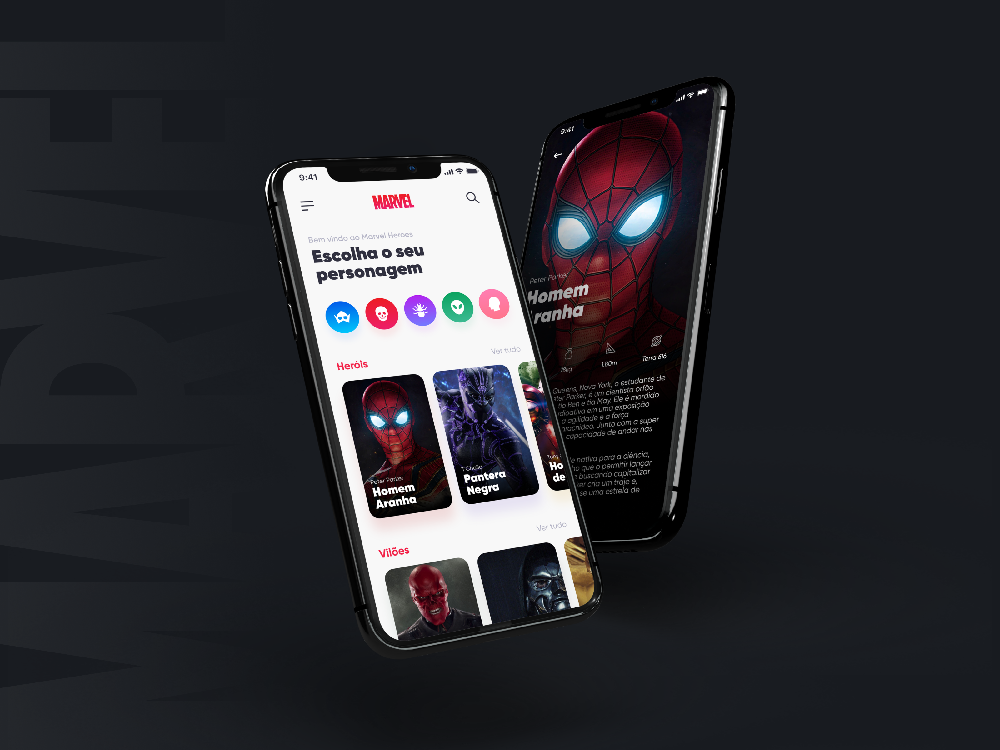
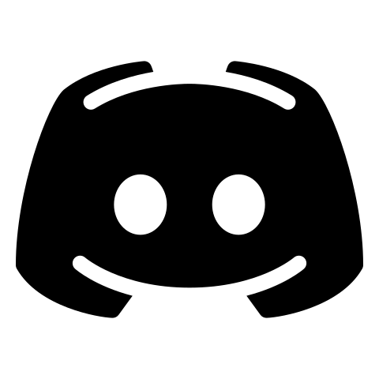
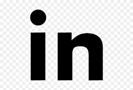
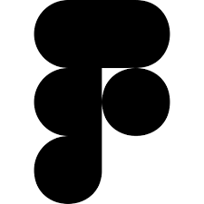
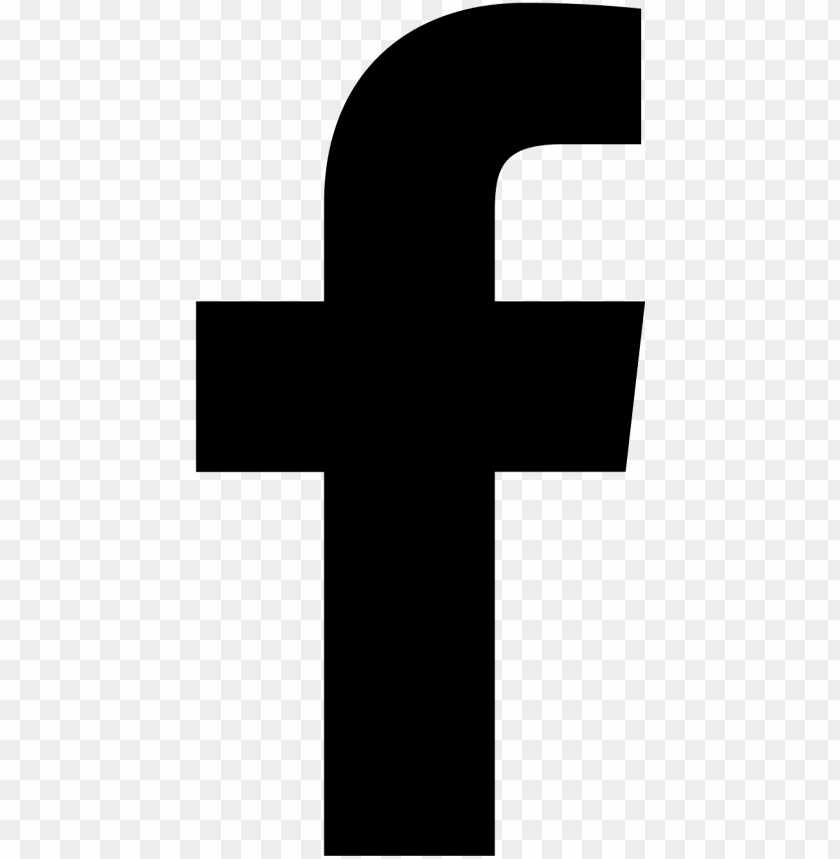
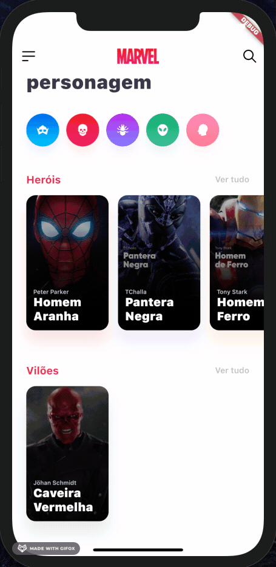
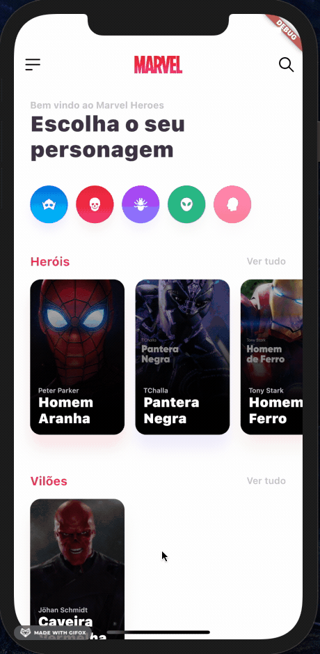
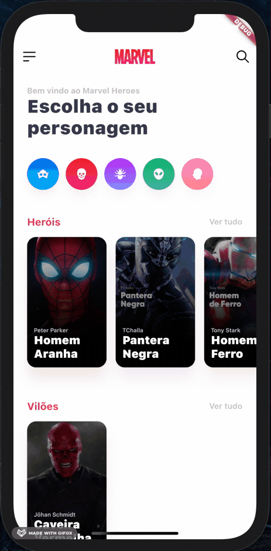

# Marvel Heroes

This is a Flutter project from some concepts extracted from the [Marvel Heroes Figma project](https://www.figma.com/community/file/849367817302905364).

This Figma project is from [umpontoseis](https://www.linkedin.com/company/umpontoseis/)

The design company [umpontoseis](https://www.linkedin.com/company/umpontoseis/) has shared the [Marvel Heroes Figma project](https://www.figma.com/community/file/849367817302905364) to help developers become acquainted to receiving design files and work from them.

### Show some :heart: and follow them on social media

<!--  -->
<!-- 
 -->

---

### App Preview

  
  
  

